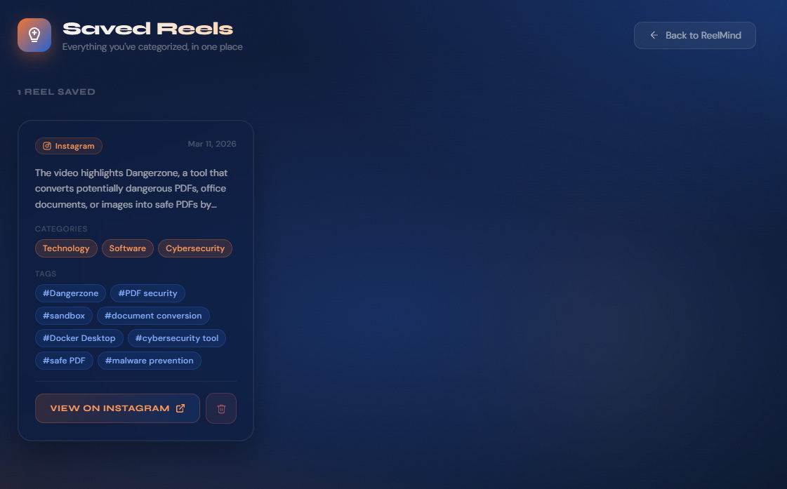
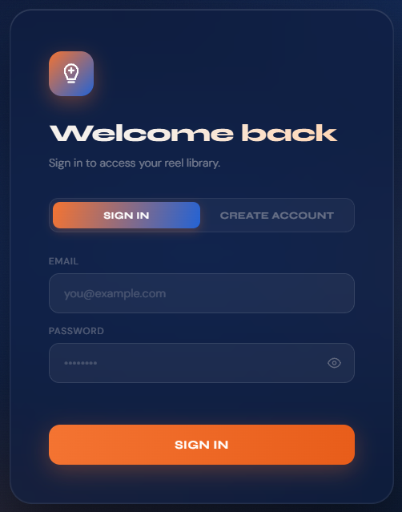

# 🧠 Reel-Mind

**the AI-powered search engine for ur digital hoarding habits.**

ok real talk: ur "Saved" folder on instagram is literally a graveyard. u got a 3-year-old sourdough recipe, a workout u SWORE u'd do, and a "life hack" for a toaster u don't even own.

**Reel-Mind** uses AI to actually categorize these reels so u can find them again. think of it as a personal librarian for ur ADHD-fueled 2am scrolling sessions. except now it has a login page so ur saved reels are actually YOURS and not just vibes floating in a database.

---

> ## 🪦 project status: shelved (but not dead)
>
> **the live demo is down.** instagram killed the yt-dlp approach that powered the whole thing and i'm not in a position to fight meta right now. the backend, the auth, the AI pipeline — all of it still works. just the video download layer got bodied.
>
> **but here's the thing:** the codebase is actually pretty clean. the architecture is solid. so instead of letting it rot in a private repo, i'm open-sourcing it.
>
> if u want to self-host ur own instance, fix the download layer, or build on top of what's here — go for it. everything u need is in [`SELF_HOSTING.md`](./SELF_HOSTING.md).

---




## 🐣 the "Freshman" Disclaimer

still a freshman. still figuring things out. the codebase is maybe slightly less spaghetti than before but like... no promises.

- **The Code:** held together with duct tape, stackoverflow, and Claude (the AI not the person. well. both actually)
- **The Logic:** it works on my machine and that's good enough for now
- **The UI:** ok tbh this one actually looks kinda clean now ngl

---

## ✨ what got built (aka the "i actually did stuff" update)

### 🔐 Auth (yes really)

there's a proper sign in / create account flow. ur reels are actually tied to ur account instead of just... existing in the void. built with supabase auth.



### 📚 Saved Reels Library

u can view ALL ur categorized reels in one place. each card shows:
- the **summary** of what the reel is actually about (so u don't have to watch it again to remember)
- the **categories** gemini slapped on it (Technology, Software, etc)
- the **tags** for more specific vibes (#Dangerzone #sandbox #malware prevention etc)
- the **date** u saved it
- a button to go **view it on instagram**
- a **delete button** for when u realize u don't actually care about that reel anymore

### ⚙️ Settings page

there's a lil settings gear icon. it exists. that's all i'll say.

### 🚀 Actually Got Deployed

was live. on the internet. for real people. good while it lasted.

---

## ⚙️ how it works (the "big brain" pipeline)

1. **The Handover:** u drop a url. app says "bet"
2. **The Heist (`yt-dlp`):** backend sneaks in and downloads the reel. digital repo man for ur memes
3. **The Interrogation (Gemini AI):** i basically tell gemini *"bro just tell me what this is and put it in a category, i am NOT rewatching 47 saved reels"*
4. **The Membership Check:** supabase auth makes sure ur actually logged in before saving anything
5. **The Archive (Supabase):** categories + tags + summary get saved to ur personal library in the db
6. **The Cleanup:** backend deletes the downloaded video immediately after. no hoarding on the server
7. **The Delivery:** fastapi sprints back to the frontend and ur reel shows up all neat and categorized

---

## 🛠️ the stack

- **Python & FastAPI** — the engine room. still fast, still forgiving when i forget a colon
- **yt-dlp** — heavy lifter that grabs the videos. legend (RIP for now)
- **Gemini AI** — the actual brain. im just the guy who asked nicely
- **Supabase** — handles the db AND auth. doing double duty. RLS enabled so ur data is actually urs
- **HTML/CSS/JS** — frontend looking cleaner than ever (claude "assisted" 🙏)
- **Railway** — where the backend lived. real deployment hours
- **GitHub Pages** — served the frontend. fast, free, zero config
- **Hopes and Dreams** — down to like 40% of the codebase now. progress.

---

## 🏗️ self-hosting

the live demo is down but u can run ur own instance. the whole setup is documented in [`SELF_HOSTING.md`](./SELF_HOSTING.md) — supabase config, railway deploy, frontend setup, the works.

**quick start:**

```bash
# 1. clone the chaos
git clone https://github.com/msjabata25/Reel-Mind.git

# 2. get the python stuff
pip install -r requirements.txt
# go make a snack, it takes a sec

# 3. set up ur .env
# SUPABASE_URL=your_url
# SUPABASE_KEY=your_service_role_key
# ALLOWED_ORIGIN=your_frontend_url

# 4. set up ur frontend config
cp config.example.js config.js
# fill in ur supabase + backend URLs

# 5. fire it up
uvicorn main:app --reload

# 6. go to localhost:8000 and pray
```

full guide with supabase table setup, RLS policies, instagram cookies, and troubleshooting → **[SELF_HOSTING.md](./SELF_HOSTING.md)**

---

## ⚠️ known issues / "features"

- **yt-dlp fragility:** instagram actively fights scrapers. this is ultimately what shelved the project. if u fix this layer, lmk
- **gemini json parsing:** gemini occasionally wraps its response in markdown fences despite being explicitly told not to. working on stripping those before parsing
- **session expiry:** supabase tokens expire after an hour. if u get a weird auth error after leaving the tab open, just sign in again
- **mobile layout:** it's... fine? mostly? squint a little

---

## 🏗️ roadmap (the "i had plans" section)

- [x] auth (sign in / create account)
- [x] saved reels library with categories + tags
- [x] delete saved reels
- [x] summary display on reel cards
- [x] search / filter ur saved reels by tag or category
- [x] RLS policies — ur data is actually urs
- [x] deployed (Railway backend + GitHub Pages frontend)
- [x] automatic video cleanup after processing
- [x] open-sourced for self-hosting
- [ ] a download layer that actually survives instagram's bot detection
- [x] TikTok + YouTube Shorts support (url validation already done, just needs testing)
- [ ] proper logging instead of `print("wtf happened")`
- [ ] react native app — mobile version
- [ ] maybe a chrome extension?? idk that sounds hard
- [ ] survive uni while also not getting left behind by the job market
- [ ] internship (still doubtful but the dream lives on)

---

## 🤝 contributing

**if ur a senior dev:** please look away. i am begging u

**if ur a fellow student:** we suffer together. PRs welcome, judgment not

**if u cracked the instagram download problem:** u are legally required to open a PR

---

*built with ❤️, ☕, way too many gemini api calls, and a very confused look on my face by [msjabata25](https://github.com/msjabata25)*
